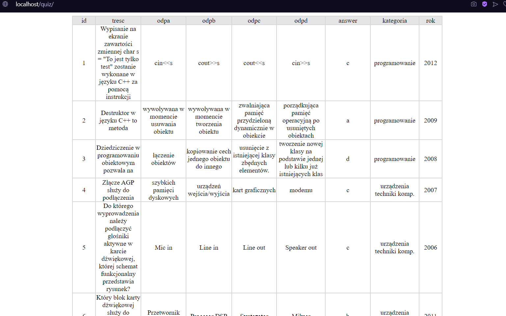

# MYSQL course #1

## Table of contents
* [General info](#general-info)
* [Setup](#setup)
* [Credits](#credits)

## General info
I'm learning the most important definitions, terminology, and vocabulary that should be known when working with databases. I am writing my first search queries.

## Setup
I use xampp with apache and mysql modules to run local server

## Credits
[Pasja_informatyki](https://www.youtube.com/c/Pasjainformatykitutoriale)